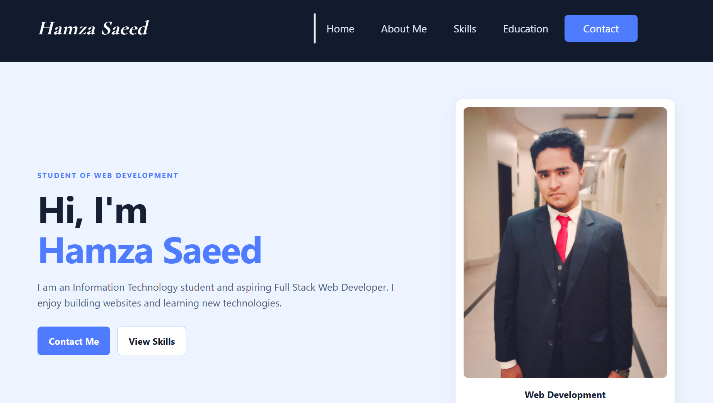

# Personal Portfolio Website

A responsive personal portfolio website built to showcase my skills, projects, and journey as a frontend developer.

## 📸 Preview



## 🌐 About

This portfolio website is designed to provide a simple and professional introduction to me, my technical skills, and the projects I have built while learning web development.

The website focuses on a clean layout, responsive design, and a straightforward user experience across different screen sizes.

## 🛠️ Technologies Used

* HTML5
* CSS3
* JavaScript
* Responsive Web Design

## ✨ Features

* Responsive navigation
* Hero section
* About section
* Skills section
* Projects section
* Contact section
* Responsive layout for desktop, tablet, and mobile
* Clean and minimal user interface

## 📂 Project Structure

```text
personal-portfolio/
│
├── index.html
├── style.css
├── script.js
├── desk.PNG
└── README.md
```

## 🚀 Getting Started

To run the project locally:

1. Clone the repository:

```bash
git clone https://github.com/Code-with-Humza/personal-portfolio.git
```

2. Open the project folder.
3. Open `index.html` in your browser.

No additional installation is required.

## 📱 Responsive Design

The website is designed to work across:

* Desktop
* Laptop
* Tablet
* Mobile

## 👨‍💻 About Me

I'm an IT student currently focused on learning frontend development and building practical projects with HTML, CSS, and JavaScript.

I'm continuously improving my skills by creating projects and exploring modern web development practices.

## 📌 Future Improvements

* Add more projects
* Improve accessibility
* Add animations and interactions
* Add a blog section
* Continue expanding my frontend skills

## 📄 License

This project is created for personal portfolio and learning purposes.

---

**Built by Hamza Saeed**
